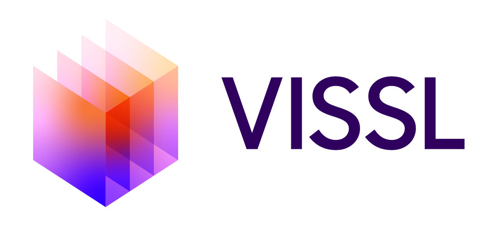

[](https://circleci.com/gh/facebookresearch/vissl)[](https://github.com/facebookresearch/vissl/blob/master/.github/CONTRIBUTING.md)

## Introduction
VISSL is a computer **VI**sion library for state-of-the-art **S**elf-**S**upervised **L**earning research with [PyTorch](https://pytorch.org). VISSL aims to accelerate research cycle in self-supervised learning: from designing a new self-supervised task to evaluating the learned representations.

Within Facebook AI, VISSL has been used to power research projects such as [SwAV](https://arxiv.org/abs/1906.02739).

## Installation

Please find installation instructions in [`INSTALL.md`](INSTALL.md).

## Getting Started

After installation, please see [`GETTING_STARTED.md`](GETTING_STARTED.md) for how to run various ssl tasks.

## License

VISSL is released under [CC-NC 4.0 International license](LICENSE).

## Tutorials

Get started with VISSL by trying one of the [tutorial notebooks][tutorials/].

## Documentation

Learn more about the API by reading the VISSL [documentation](TODO: prigoyal).

## Model Zoo and Baselines
We provide a large set of baseline results and trained models available for download in the [`VISSL Model Zoo`](MODEL_ZOO.md).

## Development

We welcome new contributions to VISSL and we will be actively maintaining this library! Please refer to [`CONTRIBUTING.md`](./.github/CONTRIBUTING.md) for full instructions on how to run the code, tests and linter, and submit your pull requests.

## Contributors

VISSL is written and maintained by the Facebook AI Research Computer Vision Team.

## Citation

If you find VISSL useful in your research, please cite:

```bibtex
@misc{goyal2020vissl,
  author =       {Priya Goyal and ... and Armand Joulin},
  title =        {VISSL},
  howpublished = {\url{https://github.com/facebookresearch/vissl}},
  year =         {2020}
}
```
