## SEER: Better, fairer computer vision through self-supervised training on uncurated internet images

_**SEER 2022**_: [[arXiv](https://arxiv.org/abs/2202.08360)], [[blogpost](https://ai.facebook.com/blog/seer-10b-better-fairer-computer-vision-through-self-supervised-learning-training-on-diverse-datasets)], _SEER 2021_: [[arXiv](https://arxiv.org/abs/2103.01988)], [[blogpost](https://ai.facebook.com/blog/seer-the-start-of-a-more-powerful-flexible-and-accessible-era-for-computer-vision/)], [[Featured in the State of AI Report 2021](https://www.stateof.ai/)]

[](https://paperswithcode.com/sota/copy-detection-on-copydays-strong-subset?p=vision-models-are-more-robust-and-fair-when)[](https://paperswithcode.com/sota/fine-grained-image-classification-on-sun397?p=vision-models-are-more-robust-and-fair-when)[](https://paperswithcode.com/sota/image-classification-on-food-101-1?p=vision-models-are-more-robust-and-fair-when)[](https://paperswithcode.com/sota/image-classification-on-dtd?p=vision-models-are-more-robust-and-fair-when)[](https://paperswithcode.com/sota/image-classification-on-clevr-count?p=vision-models-are-more-robust-and-fair-when)[](https://paperswithcode.com/sota/image-classification-on-clevr-dist?p=vision-models-are-more-robust-and-fair-when)[](https://paperswithcode.com/sota/image-classification-on-places205?p=vision-models-are-more-robust-and-fair-when)[](https://paperswithcode.com/sota/meme-classification-on-hateful-memes?p=vision-models-are-more-robust-and-fair-when)[](https://paperswithcode.com/sota/image-classification-on-inaturalist-2018?p=vision-models-are-more-robust-and-fair-when)[](https://paperswithcode.com/sota/image-classification-on-objectnet?p=vision-models-are-more-robust-and-fair-when)[](https://paperswithcode.com/sota/domain-generalization-on-imagenet-a?p=vision-models-are-more-robust-and-fair-when)[](https://paperswithcode.com/sota/domain-generalization-on-imagenet-r?p=vision-models-are-more-robust-and-fair-when)[](https://paperswithcode.com/sota/domain-generalization-on-imagenet-sketch?p=vision-models-are-more-robust-and-fair-when)

## About SEER
SEER is (a family of) **SE**lf-sup**ER**vised computer vision model trained on billions of uncurated images from internet.

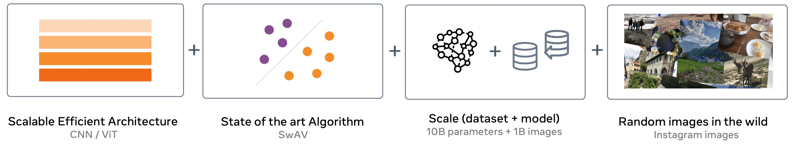

The biggest model is 10 billion dense parameters and leads to [fairer, less harmful and less biased models](#results-fairness). As model size increases, performance drastically improves on [fairness benchmarks](http://arxiv.org/abs/2202.07603) across different gender, apparent skin tone, and age groups.

We also validate the performance on _more than 50 computer vision benchmarks_. Despite training on random collections of images on the internet with no data curation, the 10B model [outperformed SOTA supervised and self-supervised models trained on ImageNet on 70 percent of the benchmarks](#results-image-classification) while achieving competitive or equal performance on the rest.

Further, this model understands images from across the world well enough to [geolocalize them with unprecedented precision](#salient-property-geolocalization). The model also discovers salient properties in the data such as [multi-lingual hashtags embedding of similar concepts](#salient-property-multilingual-hashtag-word-cloud) such as wedding even though the model is trained only on the images themselves with no location information or other metadata, it is able to group together the same concepts in multiple languages all over the world.

On top of achieving strong performance on standard computer vision benchmarks, the model also excels at challenging tasks and increases [robustness to out-of-domain generalization](#results-out-of-domain-generalization). For example, it can correctly identify animals in sketches and artistic renditions and also handles challenges in images such as camouflage, blur, occlusion, motion, and unusual perspectives.


## Pretrained Models Weights

All SEER models are pretrained on 1 Billion _random_ and _uncurated_ subset of Instagram images.

| Model | Architecture   | Parameters  | Pretrained weights | IN1K finetuned weights | ImageNet finetuned Top1 (%) 384px | iNaturalist18 finetuned Top1 (%) 384px  | Places205 finetuned Top1 (%) 384px | CopyDays Copy Detection mAP |
| ----- | -------------- |:-----------:|:----------------:|:--------------------:|:-------------------:|:---------------------:|:------------------:|:---------------------------:|
| SEER  | RG-32Gf   | 156M        | [model](https://dl.fbaipublicfiles.com/vissl/model_zoo/seer_regnet32d/seer_regnet32gf_model_iteration244000.torch)        | [model](https://dl.fbaipublicfiles.com/vissl/model_zoo/seer_finetuned/seer_regnet32_finetuned_in1k_model_final_checkpoint_phase78.torch)                                                                                   | 83.4                | 79.1                | 67.5             | 83.0                        |
| SEER  | RG-64Gf   | 250M        | [model](https://dl.fbaipublicfiles.com/vissl/model_zoo/seer_regnet64/seer_regnet64gf_model_final_checkpoint_phase0.torch)        | [model](https://dl.fbaipublicfiles.com/vissl/model_zoo/seer_finetuned/seer_regnet64_finetuned_in1k_model_final_checkpoint_phase78.torch)                                                                            | 84.0                | 80.0                | 67.4             | 83.2                        |
| SEER  | RG-128GF  | 693M        | [model](https://dl.fbaipublicfiles.com/vissl/model_zoo/swav_ig1b_regnet128Gf_cnstant_bs32_node16_sinkhorn10_proto16k_syncBN64_warmup8k/model_final_checkpoint_phase0.torch)        | [model](https://dl.fbaipublicfiles.com/vissl/model_zoo/seer_finetuned/seer_regnet128_finetuned_in1k_model_final_checkpoint_phase78.torch)                         | 84.5                | 82.6                | 67.5             | 86.5                        |
| SEER  | RG-256GF  | 1.5B        | [model](https://dl.fbaipublicfiles.com/vissl/model_zoo/swav_ig1b_cosine_rg256gf_noBNhead_wd1e5_fairstore_bs16_node64_sinkhorn10_proto16k_apex_syncBN64_warmup8k/model_final_checkpoint_phase0.torch)        | [model](https://dl.fbaipublicfiles.com/vissl/model_zoo/seer_finetuned/seer_regnet256_finetuned_in1k_model_final_checkpoint_phase38.torch)| 85.2                | 83.9                | 67.7             | 87.8                        |
| SEER  | RG-10B    | 10B         | [model](https://dl.fbaipublicfiles.com/vissl/model_zoo/seer_regnet10B/model_iteration124500_conso.torch)        | [model](https://dl.fbaipublicfiles.com/vissl/model_zoo/seer_finetuned/seer_10b_finetuned_in1k_model_phase28_conso.torch)                                                                                                             | **85.8**            | **84.7**            | **69.0**         | **90.6**                        |
## Model Documentation & License

We provide [model documentation]((./MODEL_DOCUMENTATION.md)) detailing how SEER was created and its intended uses. The use of SEER model weights is subject to the [Model License](./MODEL_LICENSE).

## Citation

```BibTeX
@article{goyal2022vision,
      title={Vision Models Are More Robust And Fair When Pretrained On Uncurated Images Without Supervision}, 
      author={Priya Goyal and Quentin Duval and Isaac Seessel and Mathilde Caron and Ishan Misra and Levent Sagun and Armand Joulin and Piotr Bojanowski},
      year={2022},
      eprint={2202.08360},
      archivePrefix={arXiv},
      primaryClass={cs.CV}
}
```

## Results: Fairness

SEER is trained on public Instagram images without any data curation and leads to more fair and less harmful models.

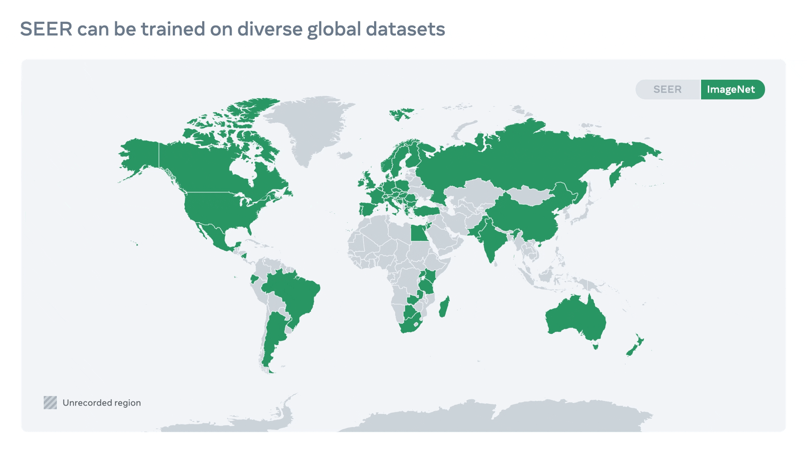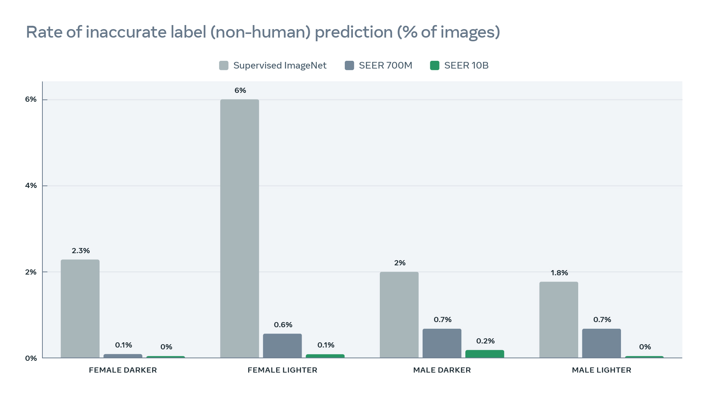
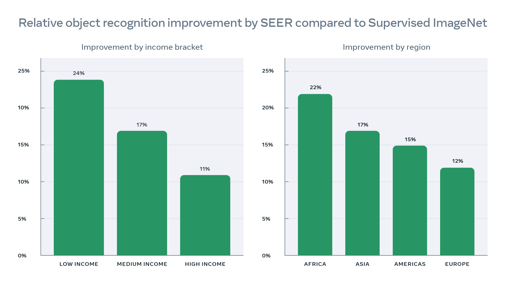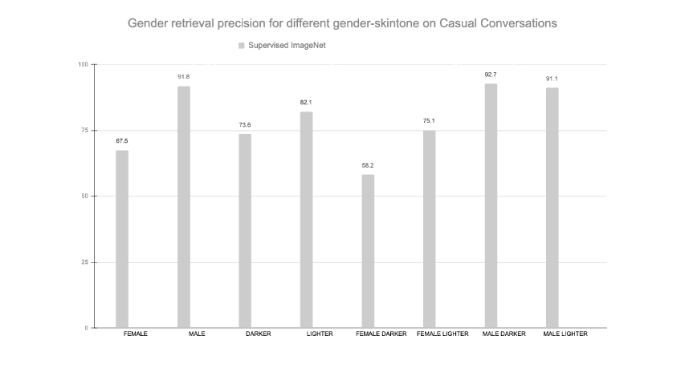

- Compared to conventional ImageNet dataset, SEER training dataset is more diverse and naturally represents images from ~200 countries as shown in the top-left figure. 
- SEER models show better object recognition performance when evaluated on geographically diverse data. The performance improves the most for low to mid income and non-Western countries (bottom-left) reducing disparity in object recognition across the world. We demonstrate the qualitative results also.
- SEER models reduce harmful label associations (top-right) and gender disparity (bottom-right) when compared to supervised pretraining on INet-1K with larger models being more fair than smaller models.

We illustrate qualitative geographical diversity results on the DollarStreet dataset, with a fixed architecture Regnet128Gf, where SEER models performance is noticeably better than models pretrained on INet-1K (such as SwAV self-supervised pretraining or supervised pretraining).

<p align="center">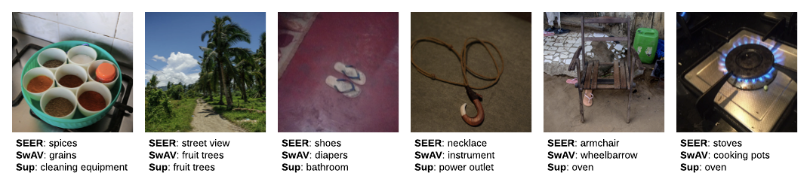</p>

See [licence](#dollarstreet-images-license) for information of the DollarStreet images above.

## Results: Out-Of-Domain Generalization

SEER model increases robustness to out-of-domain generalization. For example, it can correctly identify animals in sketches and artistic renditions and also handles challenges in images such as camouflage, blur, occlusion, motion, and unusual perspectives. Further, SEER models demonstrate superior OOD performance compared to models pretrained on INet-1K as shown below (left) for the same architecture RG-128Gf (693M parameters) for SEER compared with ImageNet based self-supervised (SwAV) and supervised pretraining. In addition, our SEER models shows great scaling trends across all OOD distribution dataset evaluations when increasing parameters from 91M to 10B parameters (right).

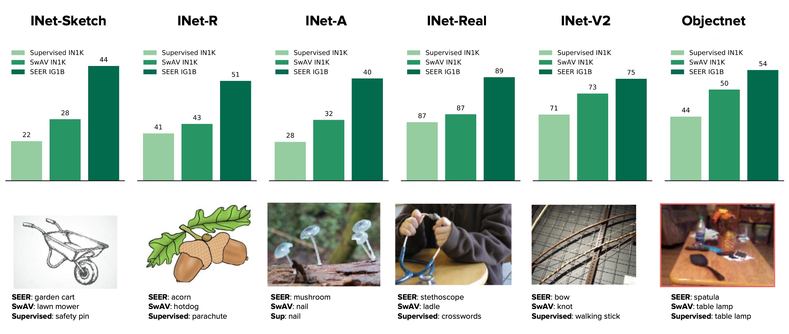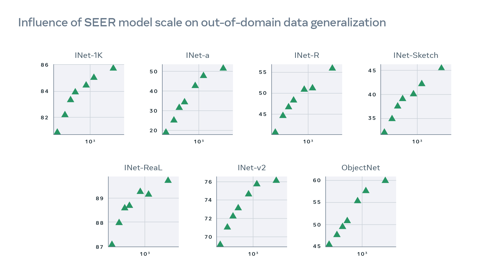

## Results: Image classification

We studied and validated SEER’s performance on more than 50 computer vision benchmarks – including robustness, fine-grained recognition, and a variety of image classification data sets from domains like medical imaging, satellite images, and optical character recognition (OCR). The 10 billion-parameter SEER model consistently outperformed its 1 billion-parameter predecessor, generating better visual features. Despite training on random collections of images on the internet with no data curation, the 10B model outperformed state-of-the-art supervised and self-supervised models trained on ImageNet on 70 percent of the benchmarks while achieving equal/competitive performance on the rest. 

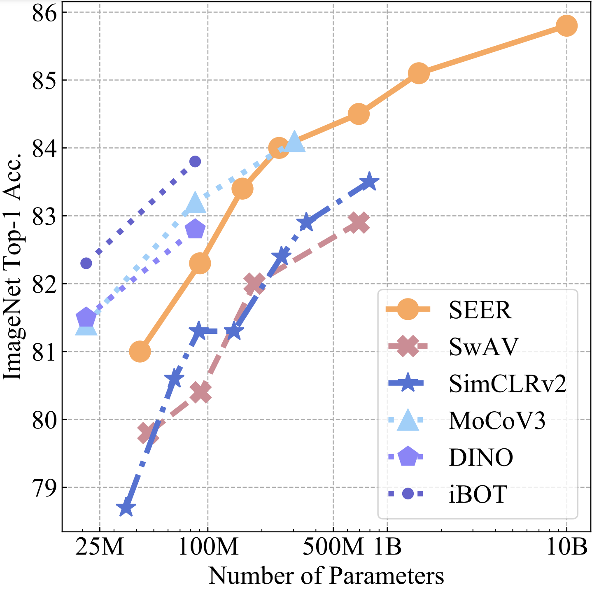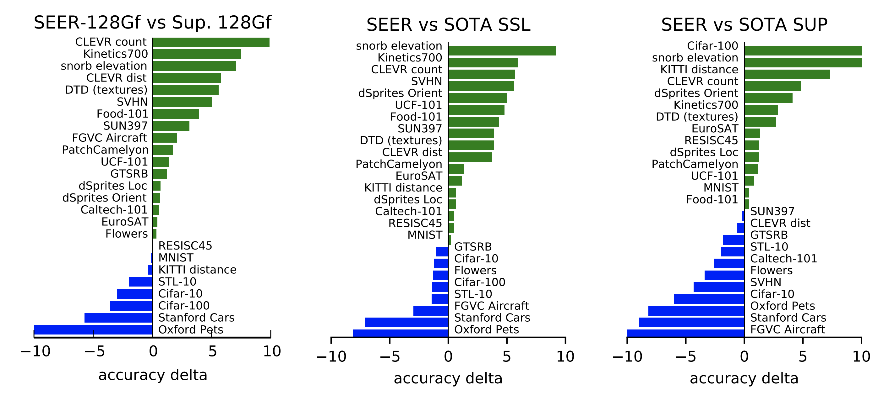

Qualitative analysis demonstrating a few examples from fine-grained image classification on iNaturalist18 and iWildsCam where SEER models perform better than models pretrained on INet-1K at equal architecture (here a RG-128Gf with 693M parameters):

<p align="center">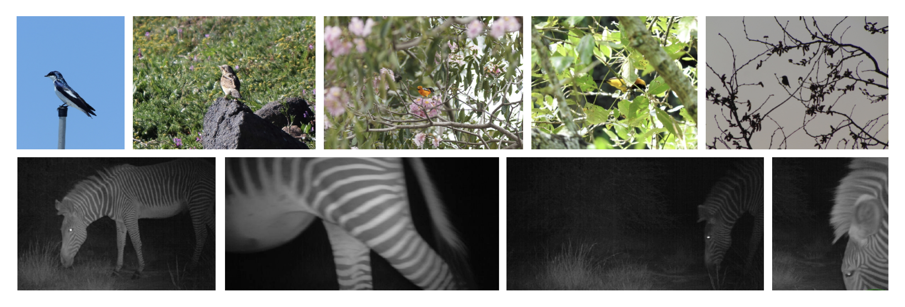</p>


## Salient Property: Multilingual Hashtag word cloud

The 10B SEER model captures salient information present in a large set of random and unfiltered internet images even across diverse geographies and linguistic concepts. For example, even though the model is trained only on the images themselves with no location information or other metadata, it is able to group together the same concepts in multiple languages all over the world. For example, the concept wedding from all over the world is embedded together in the model's feature space.

https://user-images.githubusercontent.com/7412790/153054764-f993b9b9-be67-4624-ae10-c9057ebcbaa3.mp4


## Salient Property: Geolocalization

Apart from its improved performance on fairness benchmarks, SEER model understands images from across the world well enough to geolocalize them with unprecedented precision. Our models show very strong geolocalization capabilities compared to models pre-trained on INet-1K, and especially model pretrained in a supervised fashion.

|Model            |Architecture |Street (1km)|City (25km) |Region (200km) |Country (750km)|Continent (2500km)|
|-----------------|-------------|:------:|:--------:|:--------:|:---------:|:-----------:|
|Sup INet-1K      |RG-128Gf     |13.5    |34.2      |45.6      |60.3       |72.2         |
|SwAV INet-1K     |RG-128Gf     |15.6    |  42.6    |  54.9    |72.2       |**83.5**     |
|SEER IG-1B (ours)|RG-128Gf     |**16.0**|  42.6    |  54.9    |**73.4**   |**83.5**     |
|SEER IG-1B (ours)|RG-256Gf     |15.2    |**43.9**  |**58.3**  |  73.0     |**83.5**     |

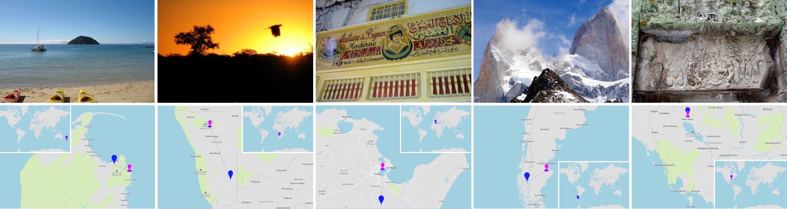

## Pre-Training 10B parameters SEER model

SEER is trained on random set of internet images (a billion public Instagram images). We share instructions on how to train SEER model on GPUs using PyTorch. First, [Install VISSL](https://github.com/facebookresearch/vissl/blob/main/INSTALL.md) and follow the [data setup instructions](https://vissl.readthedocs.io/en/latest/vissl_modules/data.html) to easily setup your data input with VISSL.

After setting up data, to train 10B parameters SEER model, use the following command line on your data source (for example 1B images):

```bash
python tools/run_distributed_engines.py \
    config=pretrain/swav/swav_8node_resnet \
    +config/pretrain/seer/models=regnet10B \
    config.DATA.TRAIN.DATA_SOURCES=[your_data_source_type] \
    config.DATA.TRAIN.DATASET_NAMES=[your_data_source_name] \
    config.OPTIMIZER.num_epochs=1 \
    config.DISTRIBUTED.NUM_NODES=62 \
    config.DISTRIBUTED.NUM_PROC_PER_NODE=8 \
```

NOTES:
* 62 x 8 = 496 GPUs with 40GB of memory are used to train our 10B model with a big enough global batch size (16 img per gpu and each image has 6 crops (2x160+4x96). We use FSDP data parallel technique for training model which shards each layer in the model across all GPU workers. For the 10B model, 8-gpus are needed to fit the model in memory. We train on 496 GPUs to train model faster.
* The number of epochs might need to be adjusted if the target dataset size is different than 1B images.
* The number of clusters for SwAV might need to be adjusted if the target data size is different than 1B images.

## Linear probe Evaluation of SEER models

### Liner probe of pre-trained models up to 1.5B parameters

For smaller SEER models (up to 1.5B parameters), evaluation can be performed similarly as evaluating any other VISSL model.

To do a linear evaluation on Imagenet-1K of a RG-128Gf SEER model with 693M parameters:

```
python tools/run_distributed_engines.py \
    config=benchmark/linear_image_classification/imagenet1k/eval_resnet_8gpu_transfer_in1k_linear \
    +config/benchmark/linear_image_classification/imagenet1k/models=regnet128Gf \
    config.MODEL.WEIGHTS_INIT.PARAMS_FILE=/path/to/seer_regnet128_model_final_checkpoint_phase0.torch
```

To do a linear evaluation on Clevr/count of a RG-256Gf SEER model with 1.5B parameters:

```
python tools/run_distributed_engines.py \
    config=benchmark/linear_image_classification/clevr_count/eval_resnet_8gpu_transfer_clevr_count_linear \
    +config/benchmark/linear_image_classification/clevr_count/models=regnet256gf_1 \
    config.MODEL.WEIGHTS_INIT.PARAMS_FILE=/path/to/seer_regnet256_model_final_checkpoint_phase0.torch
```

### Liner probe of our 10B parameter pre-trained model

The checkpoint of our 10B model takes around 36GB of RAM, and loading it as a typical checkpoint might take too much GPU RAM to load in one go.

To deal with this, VISSL has a concept of "sharded model" and "sliced checkpoints" which when combined allow a model to be initialized from a checkpoint without blowing up memory:

- Sharded models (a.k.a. FSDP models) are never fully instantiated on your GPU
- Sliced checkpoints are checkpoints split in several files to avoid taking too much memory at once

To evaluate the 10B model, unless you have GPUs with more than 40GB of RAM, you will need to first transform the checkpoint into a sliced checkpoint. This operation needs only to be done once.

```
python extra_scripts/convert_sharded_checkpoint.py \
    -i /path/to/model_iteration124500_conso.torch
    -o /output/path/to/regnet10B_sliced/model_iteration124500_sliced.torch \
    -t sliced
```

This script will transform the consolidated checkpoint into a sliced checkpoint `model_iteration124500_sliced.torch` which contains a dictionary of path from parameter names to file names, each file name containing a separate parameter.
This operation needs to be done only once: all evaluation can now refer to this sliced checkpoint.

Now, you can use this sliced checkpoint to evaluate our 10B model (for instance here on Clevr/Count):

```bash
python tools/run_distributed_engines.py \
    config=benchmark/linear_image_classification/clevr_count/eval_resnet_8gpu_transfer_clevr_count_linear \
    +config/benchmark/linear_image_classification/clevr_count/models=regnet10B \
    config.MODEL.AMP_PARAMS.USE_AMP=true \
    config.MODEL.AMP_PARAMS.AMP_TYPE=pytorch \
    config.MODEL.WEIGHTS_INIT.PARAMS_FILE=/path/to/model_iteration124500_sliced.torch
```

### Inference only of Imagenet-1K finetuned 10B SEER model

The Imagenet-1K can be evaluated on Imagenet-1K by using the `eval_resnet_8gpu_test_only`.
This configuration will just run the model one single pass on the validation set and report the accuracy metrics.
The best results are obtained with an image resolution of 384px.

We illustrate how to run this evaluation with our 10B parameters model:

```
python tools/run_distributed_engines.py \
    config=benchmark/robustness_out_of_distribution/eval_resnet_8gpu_test_only \
    +config/benchmark/fulltune/imagenet1k/transforms=tricks_384_swav \
    +config/benchmark/fulltune/imagenet1k/models=regnet10B \
    config.MODEL.WEIGHTS_INIT.PARAMS_FILE=/path/to/model_iteration124500_sliced.torch \
    config.DISTRIBUTED.NUM_PROC_PER_NODE=8
```

_Note the use of `config.DISTRIBUTED.NUM_PROC_PER_NODE=8` to use 8 GPUs. Because our 10B parameters models is too big to fit on a GPU, it needs several GPUs to be effectively sharded. You can omit the `config.DISTRIBUTED.NUM_PROC_PER_NODE=8` for smaller models (below 1.5B parameters)_


## DollarStreet Images License

The licences for the DollarStreet images used in this README.md are:

* ”Spices” India - Photo: AJ Sharma (CC BY 4.0)
* ”Street View” Philippines - Photo: Luc Forsyth (CC BY 4.0)
* ”Everyday Shoes” Brazil - Photo: Moises Morero (CC BY
4.0)
* ”Necklaces” USA - Photo: Isaiah Williams (CC BY 4.0)
* ”Armchairs” Cote d’Ivoire - Photo: Zoriah Miller (CC BY
4.0)
* ”Stoves” India - Photo: Preksha Panchamia (CC BY 4.0)
